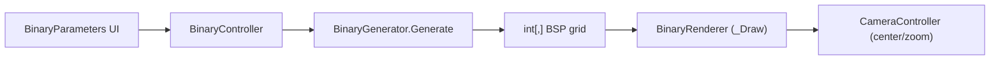

## Binary Space Partitioning Dungeon – Detailed Plan

### 1. Goals and Scope

- **Algorithm**: Implement a Binary Space Partitioning (BSP) dungeon generator that:
  - **Builds a BSP tree** over a rectangular level region.
  - **Places rooms** inside leaf regions.
  - **Connects all regions with corridors** so the dungeon is fully connected.
  - **Produces a simple `int[,]` grid** (walls vs floors) that is independent of rendering.
- **Renderer**: Implement an immediate-mode renderer that:
  - Draws the BSP dungeon using `_Draw` and `QueueRedraw()` in Godot.
  - Uses simple colors for floor vs wall for now.
  - Emits a signal to let the existing `CameraController` center on the generated grid.
- **Integration**:
  - Hook `BinaryGenerator.Generate(...)` into `BinaryController`.
  - Use `BinaryParameters` UI to drive generation parameters.
  - Keep algorithm and visualization cleanly separated.

---

### 2. Files Involved

- **Algorithm**
  - `scripts/Algorithms/BinaryGenerator.cs` – contains the BSP implementation.
- **Renderer**
  - `scripts/Renderers/BinaryRenderer.cs` – immediate-mode BSP dungeon renderer.
- **Controller & UI**
  - `scripts/Controllers/BinaryController.cs` – orchestrates generation and rendering, wires camera.
  - `scripts/UI/BinaryParameters.cs` – UI controls (width, height, min/max depth, split chance, seed, regenerate).
- **Core / Scene Management**
  - `scripts/Core/GameManager.cs` – ensures BSP demo is reachable from main menu.
  - BSP demo scene (e.g. `BinaryDemo.tscn`) – ensures node paths match controller/renderer/UI expectations.

---

### 3. Data Model and Tile Semantics

#### 3.1 Grid Representation

- **Type**: `int[,] grid` with indices `grid[x, y]`:
  - `x` = column index (0 to `width - 1`).
  - `y` = row index (0 to `height - 1`).
- **Dimensions**:
  - `width` = first dimension: `grid.GetLength(0)`.
  - `height` = second dimension: `grid.GetLength(1)`.

#### 3.2 Tile Values (Initial Simple Scheme)

- **Tile values**:
  - `0` – wall / solid / uncarved.
  - `1` – floor (used for both rooms and corridors).
- **Initialization**:
  - Create `int[,] grid = new int[width, height];`.
  - Leave all values as `0` (implicit default), then carve floor (`1`) where needed.

> Optional later: differentiate room tiles vs corridor tiles, e.g. `2` for room floor and `1` for corridor floor.

---

### 4. BSP Generator Design (`BinaryGenerator`)

We fully implement the BSP algorithm in `scripts/Algorithms/BinaryGenerator.cs`.

Current (simplified) structure:

```csharp
public static class BinaryGenerator
{
    public static int[,] Generate(
        int width,
        int height,
        int minDepth,
        int maxDepth,
        float splitChance,
        int? seed = null)
    {
        if (width <= 0 || height <= 0)
            return new int[0, 0];

        var rng = seed.HasValue ? new Random(seed.Value) : new Random();
        int[,] grid = new int[width, height];

        return grid;
    }
}
```

We will extend this with:

- A **`Node` structure** for the BSP tree.
- **`BuildTree`**, **`PlaceRooms`**, and **`ConnectRegions`** phases.
- Deterministic randomization given a seed.

#### 4.1 BSP Node Structure

Inside `BinaryGenerator`, define a **private nested class** `Node` to represent each region:

- **Fields**:
  - **Region bounds**:
    - `public int X;`
    - `public int Y;`
    - `public int Width;`
    - `public int Height;`
  - **Tree structure**:
    - `public int Depth;`
    - `public Node Left;`
    - `public Node Right;`
  - **Room info (optional)**:
    - `public int RoomX;`
    - `public int RoomY;`
    - `public int RoomWidth;`
    - `public int RoomHeight;`
  - **Helpers**:
    - `public bool IsLeaf => Left == null && Right == null;`
    - `public bool HasRoom => RoomWidth > 0 && RoomHeight > 0;`

#### 4.2 Generator Entry Point

Update `Generate(...)` in `BinaryGenerator` with these steps:

1. **Validate dimensions**:
   - If `width <= 0 || height <= 0`, return `new int[0, 0]`.
2. **Initialize RNG**:
   - `Random rng = seed.HasValue ? new Random(seed.Value) : new Random();`
3. **Create grid**:
   - `int[,] grid = new int[width, height];` (all zeros).
4. **Build BSP tree**:
   - `Node root = BuildTree(0, 0, width, height, 0, minDepth, maxDepth, splitChance, rng);`
5. **Ensure at least one leaf exists**:
   - If `root == null`, create a single root leaf node and use that.
6. **Place rooms**:
   - Call `PlaceRooms(root, grid, rng);`
7. **Connect regions**:
   - Call `ConnectRegions(root, grid, rng);`
8. **Return grid**:
   - `return grid;`

#### 4.3 `BuildTree` – Recursive BSP Partitioning

Add a **private** method:

```csharp
private static Node BuildTree(
    int x, int y, int width, int height,
    int depth,
    int minDepth, int maxDepth,
    float splitChance,
    Random rng)
```

##### 4.3.1 Stopping Conditions

- **Base leaf condition**:
  - If `depth >= maxDepth`, return a leaf node (no split).
- **Minimum region size**:
  - Define a constant, e.g.:
    - `const int MinLeafSize = 8;` (tweakable).
  - If `width < MinLeafSize || height < MinLeafSize`, return leaf (no split).

##### 4.3.2 Decide Whether to Split

- If `depth < minDepth`:
  - **Must split** if any valid split is possible (ignore `splitChance`).
- Else (`depth >= minDepth` and `< maxDepth`):
  - Sample `rng.NextDouble()`:
    - If the random value is `>= splitChance`, **do not split** (return leaf).
- If `depth >= maxDepth`:
  - **Never split**.

##### 4.3.3 Choose Split Axis

Goal: avoid extremely skinny regions.

- Strategy:
  - If `width > height`:
    - Prefer a **vertical** split (splitting along the x-axis).
  - Else if `height > width`:
    - Prefer a **horizontal** split (splitting along the y-axis).
  - If dimensions are similar:
    - Choose axis randomly using `rng.Next(2)`.

##### 4.3.4 Compute Valid Split Range

For each axis, ensure both resulting child rectangles meet `MinLeafSize`.

- **Vertical split** (splits width into left/right):
  - Valid `splitX` must satisfy:
    - Left width ≥ `MinLeafSize`.
    - Right width ≥ `MinLeafSize`.
  - Compute:
    - `int minSplitX = x + MinLeafSize;`
    - `int maxSplitX = x + width - MinLeafSize;`
  - If `minSplitX > maxSplitX` → **cannot split vertically**.

- **Horizontal split** (splits height into top/bottom):
  - Valid `splitY` must satisfy:
    - Top height ≥ `MinLeafSize`.
    - Bottom height ≥ `MinLeafSize`.
  - Compute:
    - `int minSplitY = y + MinLeafSize;`
    - `int maxSplitY = y + height - MinLeafSize;`
  - If `minSplitY > maxSplitY` → **cannot split horizontally**.

If the initially chosen axis cannot be split:

- Try the **other axis** using the same checks.
- If neither axis yields a valid split range, **return leaf**.

##### 4.3.5 Sample Split Position

- If splitting vertically:
  - `int splitX = rng.Next(minSplitX, maxSplitX + 1);`
  - Left child: `(x, y, splitX - x, height)`.
  - Right child: `(splitX, y, x + width - splitX, height)`.
- If splitting horizontally:
  - `int splitY = rng.Next(minSplitY, maxSplitY + 1);`
  - Top child: `(x, y, width, splitY - y)`.
  - Bottom child: `(x, splitY, width, y + height - splitY)`.

##### 4.3.6 Create Node and Recurse

- Create node:
  - `Node node = new Node { X = x, Y = y, Width = width, Height = height, Depth = depth };`
- Recurse:
  - `node.Left = BuildTree(child1X, child1Y, child1W, child1H, depth + 1, minDepth, maxDepth, splitChance, rng);`
  - `node.Right = BuildTree(child2X, child2Y, child2W, child2H, depth + 1, minDepth, maxDepth, splitChance, rng);`
- Return `node`.

---

### 5. Room Placement Phase (`PlaceRooms`)

Add:

```csharp
private static void PlaceRooms(Node node, int[,] grid, Random rng)
```

#### 5.1 Traversal Strategy

- If `node` is `null`, return.
- If `node.IsLeaf`, create a room inside its region.
- Else:
  - `PlaceRooms(node.Left, grid, rng);`
  - `PlaceRooms(node.Right, grid, rng);`

#### 5.2 Room Sizing Rules

Within a leaf’s region `(node.X, node.Y, node.Width, node.Height)`:

- Define constants:
  - `const int Margin = 1;` or `2`.
  - `const int MinRoomSize = 3;` or `4`.
- Compute **max room size**:
  - `int maxRoomWidth = node.Width - 2 * Margin;`
  - `int maxRoomHeight = node.Height - 2 * Margin;`
- If `maxRoomWidth < MinRoomSize` or `maxRoomHeight < MinRoomSize`:
  - Either **skip** the room (rare), or clamp to the minimum possible size that fits.
- Otherwise:
  - Room width:
    - `int roomWidth = rng.Next(MinRoomSize, maxRoomWidth + 1);`
  - Room height:
    - `int roomHeight = rng.Next(MinRoomSize, maxRoomHeight + 1);`

#### 5.3 Room Positioning Rules

- Room origin (`roomX`, `roomY`):
  - X:
    - `int maxRoomX = node.X + node.Width - Margin - roomWidth;`
    - `int roomX = rng.Next(node.X + Margin, maxRoomX + 1);`
  - Y:
    - `int maxRoomY = node.Y + node.Height - Margin - roomHeight;`
    - `int roomY = rng.Next(node.Y + Margin, maxRoomY + 1);`
- Save room on node:
  - `node.RoomX = roomX;`
  - `node.RoomY = roomY;`
  - `node.RoomWidth = roomWidth;`
  - `node.RoomHeight = roomHeight;`

#### 5.4 Carving Rooms into Grid

- For each `x` from `roomX` to `roomX + roomWidth - 1`:
  - For each `y` from `roomY` to `roomY + roomHeight - 1`:
    - Set `grid[x, y] = 1;` (floor).

---

### 6. Connection Phase (`ConnectRegions`)

Add:

```csharp
private static void ConnectRegions(Node node, int[,] grid, Random rng)
```

#### 6.1 Traversal Strategy

- If `node == null`, return.
- If `node.IsLeaf`, return (no children to connect).
- Else:
  - `ConnectRegions(node.Left, grid, rng);`
  - `ConnectRegions(node.Right, grid, rng);`
  - Then connect the **left** and **right** subtrees at this internal node.

#### 6.2 Find Connection Points

Define helper:

```csharp
private static (int x, int y) GetSubtreeRoomCenter(Node node, Random rng)
```

- If `node == null`, return `(0, 0)` or some placeholder (but try to avoid this case).
- If `node.HasRoom`:
  - Center X:
    - `int cx = node.RoomX + node.RoomWidth / 2;`
  - Center Y:
    - `int cy = node.RoomY + node.RoomHeight / 2;`
  - Return `(cx, cy)`.
- Else if `node.Left != null` or `node.Right != null`:
  - Recursively gather possible centers from `Left` and/or `Right` that have rooms.
  - Collect all valid centers and, if multiple exist, pick one randomly for variety.
- If no room exists anywhere in this subtree (should be rare if room placement is robust):
  - Fallback to **geometric center of the region**:
    - `int cx = node.X + node.Width / 2;`
    - `int cy = node.Y + node.Height / 2;`
  - Return `(cx, cy)`.

In `ConnectRegions` for each internal node:

- `var leftCenter = GetSubtreeRoomCenter(node.Left, rng);`
- `var rightCenter = GetSubtreeRoomCenter(node.Right, rng);`

#### 6.3 Carve L-Shaped Corridors

Define helper:

```csharp
private static void CarveCorridor(
    (int x, int y) from,
    (int x, int y) to,
    int[,] grid,
    Random rng)
```

Algorithm:

1. Unpack:
   - `(int x1, int y1) = from;`
   - `(int x2, int y2) = to;`
2. Choose corridor order:
   - If `rng.Next(2) == 0`:
     - First horizontal from `(x1, y1)` to `(x2, y1)`, then vertical to `(x2, y2)`.
   - Else:
     - First vertical from `(x1, y1)` to `(x1, y2)`, then horizontal to `(x2, y2)`.
3. Carve:
   - **Horizontal segment**:
     - For `x` from `min(x1, x2)` to `max(x1, x2)`:
       - Clamp indices to grid bounds.
       - `grid[x, ySegment] = 1;`
   - **Vertical segment**:
     - For `y` from `min(y1, y2)` to `max(y1, y2)`:
       - Clamp indices to grid bounds.
       - `grid[xSegment, y] = 1;`

In `ConnectRegions`:

- After computing centers:
  - `CarveCorridor(leftCenter, rightCenter, grid, rng);`

This guarantees that each internal BSP node connects its two child subtrees, yielding a fully connected dungeon.

---

### 7. Binary Renderer Design (`BinaryRenderer`)

We turn `scripts/Renderers/BinaryRenderer.cs` into an immediate-mode renderer.

#### 7.1 Fields, Exports, and Signals

In `BinaryRenderer`:

- **Fields**:
  - `private int[,] _grid;`
- **Exports**:
  - `[Export] public int CellSizePx { get; set; } = 8;` (or `16`, consistent with other demos).
  - `[Export] public Color WallColor { get; set; } = new Color(0.1f, 0.1f, 0.1f);`
  - `[Export] public Color FloorColor { get; set; } = new Color(0.8f, 0.8f, 0.8f);`
- **Signal for camera** (to match other renderers):
  - `[Signal] public delegate void GridGeneratedEventHandler(int width, int height, int cellSize);`

#### 7.2 `Render` Method

Implementation steps:

1. Store the grid:
   - `_grid = grid;`
2. Handle empty grid:
   - If `_grid == null` or `GetLength(0) <= 0` or `GetLength(1) <= 0`:
     - `EmitSignal(SignalName.GridGenerated, 0, 0, CellSizePx);`
     - `QueueRedraw();`
     - `return;`
3. Otherwise, emit valid size:
   - `int width = _grid.GetLength(0);`
   - `int height = _grid.GetLength(1);`
   - `EmitSignal(SignalName.GridGenerated, width, height, CellSizePx);`
   - `QueueRedraw();`

#### 7.3 `_Draw` Implementation

Override `_Draw()`:

- Early-out:
  - If `_grid == null` or has zero width/height, `return;`.
- Compute:
  - `int width = _grid.GetLength(0);`
  - `int height = _grid.GetLength(1);`
  - `Vector2 cellSizeVec = new Vector2(CellSizePx, CellSizePx);`
- Loop:
  - For each `x` in `[0, width)`:
    - For each `y` in `[0, height)`:
      - `int value = _grid[x, y];`
      - `Color color = value == 1 ? FloorColor : WallColor;`
      - `Vector2 pos = new Vector2(x * CellSizePx, y * CellSizePx);`
      - `DrawRect(new Rect2(pos, cellSizeVec), color, filled: true);`

This renders a solid grid of rectangles where floors and walls have different colors.

---

### 8. Controller and UI Integration

#### 8.1 `BinaryController`

File: `scripts/Controllers/BinaryController.cs`

Controller responsibilities:

- Store generation parameters:
  - `Width`, `Height`, `MinDepth`, `MaxDepth`, `SplitChance`, `Seed`.
- On `_Ready()`:
  - Locate `BinaryRenderer` in the scene tree (e.g. sibling node named `"BinaryRenderer"`).
  - Locate `CameraController` (e.g. sibling node `"CameraController"`).
  - Connect:
    - `_renderer.GridGenerated += _camera.CenterCameraOnGrid;`
  - Call `Regenerate();`.
- In `Regenerate()`:
  - Call:
    - `int[,] grid = BinaryGenerator.Generate(Width, Height, MinDepth, MaxDepth, SplitChance, Seed > 0 ? Seed : (int?)null);`
  - Then:
    - `_renderer.Render(grid);`

Ensure:

- The class names match actual scripts:
  - Controller class is `BinaryController`.
  - Renderer class is `BinaryRenderer`.
  - Generator class is `BinaryGenerator`.
- Node paths used in `GetNodeOrNull` match the scene tree.

#### 8.2 `BinaryParameters` UI

File: `scripts/UI/BinaryParameters.cs`

Responsibilities:

- On `_Ready()`:
  - Find the `BinaryController` via a known relative path (e.g. `"../../BinaryController"`).
  - Get references to:
    - Width/Height `SpinBox`es.
    - MinDepth/MaxDepth `SpinBox`es.
    - SplitChance `SpinBox`.
    - Seed `LineEdit`.
    - Regenerate `Button`.
  - Initialize UI values from the controller’s current properties.
  - Connect the button’s `Pressed` signal to `OnRegeneratePressed`.
- In `OnRegeneratePressed()`:
  - Read values from UI controls.
  - Set controller properties:
    - `Width`, `Height`, `MinDepth`, `MaxDepth`, `SplitChance`, `Seed`.
  - Call `_controller.Regenerate();`.

Ensure:

- The type name referenced in this script matches the actual controller (`BinaryController`).
- The scene layout (Control nodes) matches the paths used in `GetNode<...>()`.

---

### 9. Scene and Camera Behavior

#### 9.1 BSP Demo Scene Layout

Conceptual hierarchy:

- `BinaryDemoRoot` (root node)
  - `BinaryController` (script: `BinaryController.cs`)
  - `BinaryRenderer` (script: `BinaryRenderer.cs`, child or sibling under same parent)
  - `CameraController` (existing script used in other demos)
  - `UI` (Control node with `BinaryParameters` script)
  - `BackButton` or input handling to return to main menu

Requirements:

- `BinaryController` can find:
  - `BinaryRenderer` via `GetNodeOrNull<BinaryRenderer>("BinaryRenderer")` or similar.
  - `CameraController` via `GetNodeOrNull<CameraController>("CameraController")`.
- `BinaryParameters` can find `BinaryController` via its relative path.

#### 9.2 Camera Centering

- `BinaryRenderer` emits:
  - `GridGenerated(width, height, CellSizePx)`.
- `BinaryController` connects:
  - `_renderer.GridGenerated += _camera.CenterCameraOnGrid;`
- `CameraController.CenterCameraOnGrid`:
  - Uses `width * CellSizePx` and `height * CellSizePx` to compute dungeon size.
  - Centers camera accordingly.

Verify:

- Generated dungeon is centered and visible.
- Panning and zooming behave like in other demos (Wave, CA, etc.).

---

### 10. Testing Checklist

#### 10.1 Functional Tests

- **Grid generation**:
  - Try `Width`/`Height`:
    - 40×40, 80×60, 100×100, 120×80.
  - Check:
    - Rooms of various sizes appear.
    - Corridors connect rooms into one connected layout (no isolated rooms).
- **Depth and split chance**:
  - Adjust `MinDepth` and `MaxDepth`:
    - Deeper trees → more, smaller rooms and more corridors.
  - Adjust `SplitChance`:
    - Near `1.0` → more subdivision, many small regions.
    - Near `0.2`–`0.3` → fewer splits, larger regions/rooms.
- **Seed reproducibility**:
  - Fix `Seed` and regenerate multiple times → same layout.
  - Change `Seed` → different layouts.

#### 10.2 Visual Tests

- Ensure:
  - Rooms appear as solid rectangular areas of floor.
  - Corridors visibly connect rooms.
  - No out-of-bounds artifacts (no exceptions).
  - No obvious off-by-one errors:
    - Rooms do not exceed their BSP region.
    - Corridors are continuous (no missing tiles).
- Confirm:
  - Visual origin and orientation (top-left vs bottom-left) match expectations.
  - Camera centering places the dungeon nicely in the viewport.

#### 10.3 Edge Cases

- Very small maps (e.g. 10×10):
  - At least one room still appears.
  - No crashes.
- Extreme depths:
  - Very high `MaxDepth` relative to map size:
    - Splitting stops gracefully once regions hit `MinLeafSize`.
- Invalid dimensions:
  - `Width <= 0` or `Height <= 0`:
    - `BinaryGenerator.Generate` returns `int[0,0]`.
    - `BinaryRenderer.Render` handles it gracefully (no drawing, emits zero grid).

---

### 11. Future Enhancements (Optional)

- **Differentiate room vs corridor tiles**:
  - Use `2` for room floor, `1` for corridor floor.
  - Adjust `BinaryRenderer` to color them differently (e.g. bright rooms, darker corridors).
- **TileMap renderer (bonus)**:
  - Add `BinaryTileMapRenderer` similar to `WaveTileMapRenderer`.
  - Map:
    - `0` → wall tile.
    - `1` → corridor floor tile.
    - `2` → room floor tile.
- **Decorative passes**:
  - Add doors at room–corridor boundaries.
  - Place entities (player spawn, exit, enemies) using BSP tree depth or position.

---

### 12. High-Level Flow Diagram



