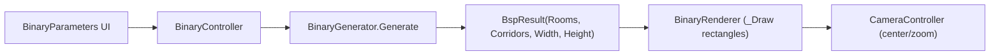

## Binary Space Partitioning (BSP) Dungeon — Visual Demo Plan (Rectangles Only)

This plan is **purely visual**. The BSP algorithm outputs **room rectangles** and **corridor rectangles** in tile coordinates. The renderer draws those rectangles with `_Draw()`. We do **not** create or use an `int[,]` tile grid or `TileMapLayer`.

---

### 1. Goals and Non-Goals

- **Algorithm goals**:
  - **BuildTree**: recursively split the world rectangle into a BSP tree of regions.
  - **PlaceRooms**: put one room rectangle inside each leaf region.
  - **ConnectRegions**: connect sibling partitions so the layout is fully connected.
  - **Output**: a compact data object (`BspResult`) with:
    - Overall width/height in tiles.
    - A list of room `Rect2I`s.
    - A list of corridor `Rect2I`s.
- **Renderer goals**:
  - Draw rooms and corridors using **one `DrawRect` per room/corridor segment**.
  - Use simple colors (e.g., white rooms, gray corridors).
  - Emit a signal so the existing `CameraController` can center on the layout given width/height and cell size.
- **Non-goals** (for this assignment stage):
  - No per-tile collision or gameplay.
  - No tile grid (`int[,]`).
  - No TileMap-based rendering.

---

### 2. Files and Responsibilities

- **Algorithm**
  - `scripts/Algorithms/BinaryGenerator.cs`
    - Implements BSP splitting, room placement, and corridor connection.
    - Returns `BspResult`.
- **Renderer**
  - `scripts/Renderers/BinaryRenderer.cs`
    - Immediate-mode drawing with `_Draw()` + `QueueRedraw()`.
    - Consumes `BspResult` and draws scaled rectangles.
    - Emits a signal for camera centering.
- **Controller + UI**
  - `scripts/Controllers/BinaryController.cs`
    - Holds parameters (width, height, minDepth, maxDepth, splitChance, seed).
    - Calls `BinaryGenerator.Generate(...)`.
    - Passes `BspResult` to `BinaryRenderer.Render(...)`.
  - `scripts/UI/BinaryParameters.cs`
    - Updates controller parameters and calls `Regenerate()` from the UI.

---

### 3. Coordinate System and Output Data Model

#### 3.1 Tile-space coordinates

- All BSP calculations and rectangles are in **tile space**:
  - \(x\) increases to the right, \(y\) increases downward.
  - `Rect2I`:
    - `Position` = (tileX, tileY) of the top-left corner.
    - `Size` = (widthInTiles, heightInTiles).
- The renderer will convert tile space to world/pixel space using `CellSizePx`.

#### 3.2 Result type (`BspResult`)

Create a small shared struct/class to hold the generator’s output:

```csharp
public struct BspResult
{
    public int Width;                 // logical width in tiles
    public int Height;                // logical height in tiles
    public List<Rect2I> Rooms;        // one rect per room (tile-space)
    public List<Rect2I> Corridors;    // corridor segments (tile-space)
}
```

Notes:

- `Width` and `Height` are used by the camera for centering/zooming.
- `Rooms` and `Corridors` are separate so they can be drawn with different colors.

---

### 4. BSP Generator Design (`BinaryGenerator`)

The generator is responsible for producing the BSP tree and the final `BspResult`.

#### 4.1 Public API

In `scripts/Algorithms/BinaryGenerator.cs`:

```csharp
public static BspResult Generate(
    int width,
    int height,
    int minDepth,
    int maxDepth,
    float splitChance,
    int? seed = null)
```

Behavior:

- If `width <= 0 || height <= 0`:
  - Return a `BspResult` with `Width = 0`, `Height = 0`, and empty `Rooms`/`Corridors`.
- Otherwise:
  - Create `Random rng` (seeded if `seed` is provided).
  - Build a BSP tree for region `(0, 0, width, height)`.
  - Allocate:
    - `rooms = new List<Rect2I>();`
    - `corridors = new List<Rect2I>();`
  - Call:
    - `PlaceRooms(root, rooms, rng);`
    - `ConnectRegions(root, corridors, rng);`
  - Return:

```csharp
return new BspResult
{
    Width = width,
    Height = height,
    Rooms = rooms,
    Corridors = corridors
};
```

#### 4.2 BSP Node structure

Inside `BinaryGenerator`, define a private nested `Node`:

- **Region bounds** (the BSP region, not necessarily the room):
  - `public int X, Y, Width, Height;`
  - `public int Depth;`
- **Tree structure**:
  - `public Node Left, Right;`
  - `public bool IsLeaf => Left == null && Right == null;`
- **Room info** (valid only on leaves):
  - `public int RoomX, RoomY, RoomWidth, RoomHeight;`
  - `public bool HasRoom => RoomWidth > 0 && RoomHeight > 0;`

#### 4.3 `BuildTree` — recursive splitting

Signature:

```csharp
private static Node BuildTree(
    int x, int y, int width, int height,
    int depth,
    int minDepth, int maxDepth,
    float splitChance,
    Random rng)
```

Constants (tunable):

- `const int MinLeafSize = 8;` (min width/height of a region before we stop splitting).

Algorithm:

- If `depth >= maxDepth`, return a leaf `Node` with the given bounds.
- If `width < MinLeafSize || height < MinLeafSize`, return a leaf.
- Decide whether to split:
  - If `depth < minDepth`:
    - Force splitting if any valid split is possible.
  - Else:
    - Sample `rng.NextDouble()`; if value >= `splitChance`, return leaf.
- Choose axis:
  - If `width > height` → prefer vertical split.
  - Else if `height > width` → prefer horizontal split.
  - If similar → random choice.
- Compute valid split range for chosen axis so both children have `Width/Height >= MinLeafSize`.
  - If chosen axis has no valid split range:
    - Try the other axis.
  - If neither axis can be split:
    - Return leaf.
- Pick split position uniformly at random within the valid range.
- Create node with the current region, then recursively create `Left` and `Right` child nodes.

Return the constructed `Node`.

---

### 5. Room Placement (`PlaceRooms`)

We place exactly one room per leaf region.

#### 5.1 API

```csharp
private static void PlaceRooms(Node node, List<Rect2I> rooms, Random rng)
```

Traversal:

- If `node == null`, return.
- If `node.IsLeaf`:
  - Create a room completely inside `(node.X, node.Y, node.Width, node.Height)`.
  - Save the room on the node and add its `Rect2I` to `rooms`.
- Else:
  - Recurse:
    - `PlaceRooms(node.Left, rooms, rng);`
    - `PlaceRooms(node.Right, rooms, rng);`

#### 5.2 Room sizing and positioning

Constants (tunable):

- `const int Margin = 1;` or `2`;
- `const int MinRoomSize = 3;` or `4`.

Steps for a leaf node:

- Compute max possible room size:
  - `maxRoomWidth = node.Width - 2 * Margin;`
  - `maxRoomHeight = node.Height - 2 * Margin;`
- If `maxRoomWidth < MinRoomSize` or `maxRoomHeight < MinRoomSize`:
  - Option A: skip room (rare).
  - Option B: clamp room to smallest possible size that still fits (e.g., use `Math.Max(1, maxRoomWidth)`).
- Otherwise:
  - Random room size:
    - `roomWidth = rng.Next(MinRoomSize, maxRoomWidth + 1);`
    - `roomHeight = rng.Next(MinRoomSize, maxRoomHeight + 1);`
- Room origin:
  - `int maxRoomX = node.X + node.Width - Margin - roomWidth;`
  - `int roomX = rng.Next(node.X + Margin, maxRoomX + 1);`
  - `int maxRoomY = node.Y + node.Height - Margin - roomHeight;`
  - `int roomY = rng.Next(node.Y + Margin, maxRoomY + 1);`
- Save on node:
  - `node.RoomX = roomX;`
  - `node.RoomY = roomY;`
  - `node.RoomWidth = roomWidth;`
  - `node.RoomHeight = roomHeight;`
- Add to list:
  - `rooms.Add(new Rect2I(roomX, roomY, roomWidth, roomHeight));`

---

### 6. Connecting Regions (`ConnectRegions`)

We connect sibling partitions to guarantee a fully connected layout.

#### 6.1 API

```csharp
private static void ConnectRegions(Node node, List<Rect2I> corridors, Random rng)
```

Traversal:

- If `node == null` or `node.IsLeaf`, return.
- Recurse:
  - `ConnectRegions(node.Left, corridors, rng);`
  - `ConnectRegions(node.Right, corridors, rng);`
- Then connect left and right subtrees at this internal node.

#### 6.2 Finding connection points (room centers)

Helper:

```csharp
private static (int x, int y) GetSubtreeRoomCenter(Node node, Random rng)
```

- If `node == null`, return a dummy (should be avoided in practice).
- If `node.HasRoom`:
  - `cx = node.RoomX + node.RoomWidth / 2;`
  - `cy = node.RoomY + node.RoomHeight / 2;`
  - Return `(cx, cy)`.
- Else if node has children:
  - Recursively collect centers from leaves that have rooms.
  - If multiple centers found, pick one at random (`rng`) for variety.
- If no rooms at all in the subtree (very rare if room placement is robust):
  - Fallback to region center:
    - `cx = node.X + node.Width / 2;`
    - `cy = node.Y + node.Height / 2;`

In `ConnectRegions` for each internal node:

- `var leftCenter = GetSubtreeRoomCenter(node.Left, rng);`
- `var rightCenter = GetSubtreeRoomCenter(node.Right, rng);`
- Use those to create corridor segments.

#### 6.3 Corridor segments as rectangles

Helper:

```csharp
private static void AddCorridorSegments(
    (int x, int y) from,
    (int x, int y) to,
    List<Rect2I> corridors,
    Random rng)
```

Algorithm:

- Unpack:
  - `(x1, y1) = from;`
  - `(x2, y2) = to;`
- Choose order (L-shape):
  - If `rng.Next(2) == 0`:
    - First horizontal, then vertical.
  - Else:
    - First vertical, then horizontal.
- Horizontal segment (if needed):
  - `xMin = Math.Min(x1, x2);`
  - `xMax = Math.Max(x1, x2);`
  - `length = xMax - xMin + 1;`
  - `Rect2I horiz = new Rect2I(xMin, yFixed, length, 1);`
- Vertical segment (if needed):
  - `yMin = Math.Min(y1, y2);`
  - `yMax = Math.Max(y1, y2);`
  - `length = yMax - yMin + 1;`
  - `Rect2I vert = new Rect2I(xFixed, yMin, 1, length);`
- Add:
  - `corridors.Add(horiz);`
  - `corridors.Add(vert);`

This yields **two rectangles per corridor** (horizontal and vertical legs), which is very cheap to draw.

---

### 7. Renderer Plan (`BinaryRenderer`) — Rectangle Drawing

The renderer uses `BspResult` and immediate-mode drawing.

#### 7.1 Fields, exports, signals

- Fields:
  - `private List<Rect2I> _rooms;`
  - `private List<Rect2I> _corridors;`
- Exports:
  - `[Export] public int CellSizePx { get; set; } = 8;`
  - `[Export] public Color RoomColor { get; set; } = new Color(0.8f, 0.8f, 0.8f);`
  - `[Export] public Color CorridorColor { get; set; } = new Color(0.6f, 0.6f, 0.6f);`
  - `[Export] public Color BackgroundColor { get; set; } = new Color(0.05f, 0.05f, 0.05f);` (optional background).
- Signal:
  - `[Signal] public delegate void GridGeneratedEventHandler(int width, int height, int cellSize);`
    - Used by `CameraController` to center and zoom.

#### 7.2 `Render` method

```csharp
public void Render(BspResult result)
```

Steps:

- Store data:
  - `_rooms = result.Rooms ?? new List<Rect2I>();`
  - `_corridors = result.Corridors ?? new List<Rect2I>();`
- Signal camera extents:
  - If `result.Width <= 0 || result.Height <= 0`:
    - `EmitSignal(SignalName.GridGenerated, 0, 0, CellSizePx);`
  - Else:
    - `EmitSignal(SignalName.GridGenerated, result.Width, result.Height, CellSizePx);`
- Request redraw:
  - `QueueRedraw();`

#### 7.3 `_Draw()` implementation

- Optionally draw a background rect based on total extents:
  - `DrawRect(new Rect2(Vector2.Zero, new Vector2(result.Width * CellSizePx, result.Height * CellSizePx)), BackgroundColor, true);`
- Draw rooms:
  - For each `Rect2I room` in `_rooms`:
    - `posPx = room.Position * CellSizePx;`
    - `sizePx = room.Size * CellSizePx;`
    - `DrawRect(new Rect2(posPx, sizePx), RoomColor, true);`
- Draw corridors:
  - For each `Rect2I c` in `_corridors`:
    - Same scaling, but use `CorridorColor`.

The total number of draw calls is roughly `rooms.Count + corridors.Count`, which is very small compared to `width * height`.

---

### 8. Controller + UI Wiring

#### 8.1 `BinaryController`

Responsibilities:

- Hold parameters:
  - `Width`, `Height`, `MinDepth`, `MaxDepth`, `SplitChance`, `Seed`.
- On `_Ready()`:
  - Find `BinaryRenderer` and `CameraController` nodes.
  - Connect:
    - `_renderer.GridGenerated += _camera.CenterCameraOnGrid;`
  - Call `Regenerate();`
- `Regenerate()`:
  - Call `BspResult result = BinaryGenerator.Generate(...);`
  - Call `_renderer.Render(result);`

#### 8.2 `BinaryParameters`

Responsibilities:

- Find the controller (`../../BinaryController` or whatever the scene path is).
- On `_Ready()`:
  - Hook UI controls (SpinBoxes, LineEdit, Button).
  - Initialize UI from controller’s current values.
- On regenerate button press:
  - Copy UI values into controller properties.
  - Call `_controller.Regenerate();`

---

### 9. Scene Layout and Camera Behavior

#### 9.1 Scene hierarchy (conceptual)

- Root: `BinaryBspDemo` (Node2D or similar)
  - `BinaryController`
  - `BinaryRenderer`
  - `CameraController`
  - `UI` (Control with `BinaryParameters`)
  - Back-to-menu control

#### 9.2 Camera behavior

- `BinaryRenderer` emits `GridGenerated(width, height, CellSizePx)`.
- `CameraController.CenterCameraOnGrid(int width, int height, int cellSize)`:
  - Converts tile extents to world extents and centers the camera.
- Panning/zoom inputs should match other demos.

---

### 10. Testing Checklist (Visual Demo)

- **Parameter sweeps**:
  - Vary `Width/Height` (e.g. 50×50, 100×60, 300×300).
  - Vary `MinDepth/MaxDepth` and `SplitChance`:
    - Low depth / low split → few large rooms.
    - High depth / high split → many small rooms and corridors.
- **Seed reproducibility**:
  - Same `Seed` → identical layout.
  - Different `Seed` → different layout.
- **Visual sanity**:
  - Rooms lie within their BSP regions (no obvious overflow).
  - Corridors visibly connect regions; no isolated “islands”.
  - No degenerate rectangles (zero or negative width/height).
  - Camera centers the layout correctly.

---

### 11. High-Level Flow Overview



